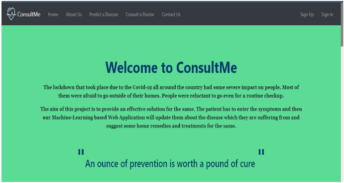
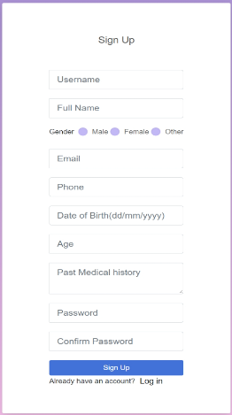
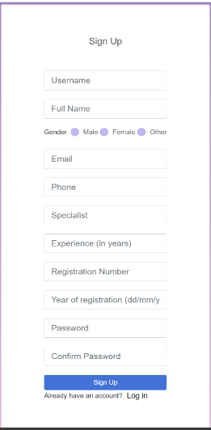
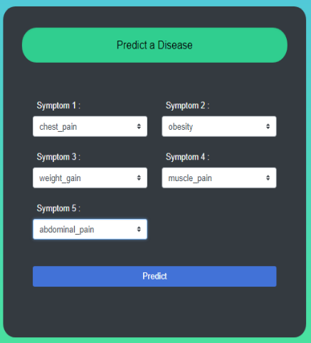
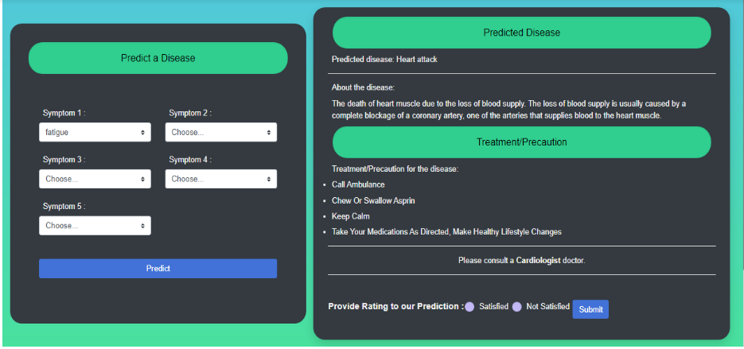
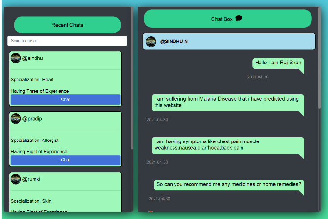

<div align="center">

[](https://www.python.org "Python3")
[](https://code.visualstudio.com/ "Visual Studio Code")


</div>

<p align="center">
  <a href="" rel="noopener">
 </a>
 
</p>
<h1 align = 'center'><b>ConsultMe</b></h1> 

## Description ##
<p>
  The lockdown that took place due to the Covid-19 all around the country had some severe impact on people. 
  Most of them were afraid to go outside of their homes. 
  People were reluctant to go even for a routine checkup.
  To provide an effective solution for the same we have created this website.
  Here we have incorporated a Machine learning model which would predict the disease the user might be suffering from, based on the symptoms which they have given as the input     and will also suggest some home remedies and medicines for the same. 
  We will also provide the patient an option to consult with a doctor online to get their expert opinion.
<p>
  
---
  
## Features ##
- Predict diseases based on the symptoms selected by the user.
- Consult with the doctors online to get their expert opinion.
- Get home remedies and medicines recommended for the predicted disease.
- Graphical insights about the rating of the doctor and the prediction history of all the patients.
- User authentication and profile customization.
---

## How To Use
#### Software Requirements
- A text editor(like Visual Studio Code)
- Either MySQL or PostgreSQL server on your local machine
- Python (v3.8.5)

#### Installation
Install the dependencies
```html  
pip install -r requirements.txt
```

#### Execute the code 

```html
python run.py
```

---
## Demo
### Home Page
<br>
<p align='center'>
  
  
</p>

### Patient's Registration Page
<br>
<p align='center'>
  
</p>

### Doctor's Registration Page
<br>
<p align='center'>
  
</p>

### Prediction of disease
#### Select the symptoms
<br>
<p align='center'>
  
</p>

#### Prediction
<br>
<p align='center'>
  
</p>

### Consultation
<br>
<p align='center'>
  
</p>

---
### Tech stack

`Frontend` : HTML, CSS, Javascript, Bootstrap <br>
`Backend` : Python(Flask framework) <br>
`Database` : MySql <br>

------------------------------------------

<h3 align="center"><b>Developed  by <a href="https://github.com/Parth18Shah">Parth Shah</a> and <a href="https://github.com/rjshah00">Raj Shah</b></h3>
